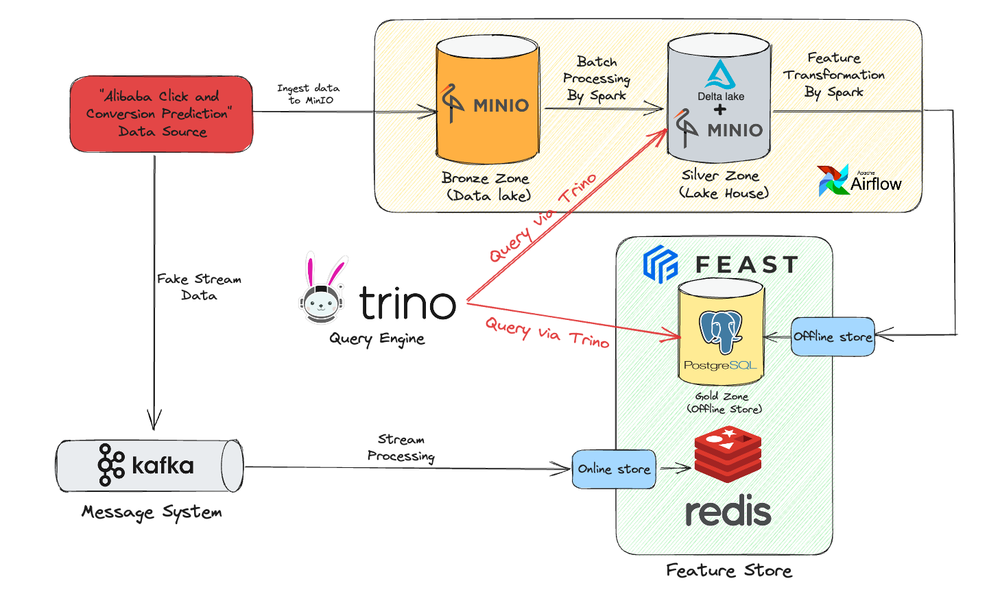

# Alicpp - Data Engineer and Feature Store project
## Introduction:

This repository contains code and documentation for my personal data engineering project, which involves building a robust data pipeline to ingest, process, and serve data for analysis and machine learning applications.

## Project Overview

The project leverages several popular open-source technologies to create an end-to-end data pipeline. The flow of data and roles of the main components are as follows:

1. **Alibaba Click and Conversion Prediction Data Source**: This raw data set is provided by Alimama (*~40GB*), which is gathered from real-world traffic logs of the recommender system in Taobao.  You can download and see more detail at [this link](https://tianchi.aliyun.com/dataset/408). 
2. **Kafka**: A distributed message system used for ingesting and streaming the raw data from the source.
3. **MINIO**: An *object storage* service used for storing the raw data (Bronze Zone) and processed data (Silver Zone).
4. **Apache Spark**: A powerful distributed processing engine used for batch&stream processing data.
5. **FEAST**: FEAST, a feature store, is the central component that serves as a unified interface for accessing both the offline and online feature data stores. 
	1. **Postgres**: For offline storage, FEAST uses Postgres (the Gold Zone). A relational database used by FEAST for offline storage (Gold Zone).
	2. **Redis**: For online storage, low-latency storage and serving, it uses Redis. An in-memory data store used for online storage of feature data used by FEAST.
6. **Airflow**: A workflow management system used for scheduling and monitoring the data pipeline tasks.
7. **Trino**: A distributed SQL query engine used for querying the data.

### Data flow:
- The data flow starts from the Alibaba Click and Conversion Prediction Data Source. 
- Then, this raw data is ingested into Bronze Zone of MINIO. 
- Apache Spark, a distributed processing engine, reads the raw data from MINIO's Bronze Zone, performs batch processing tasks like data cleaning, transformation, and feature engineering, and outputs the processed data to MINIO's Silver Zone, also known as the "Lake House."
- The data is further processed in batch processing mode by Spark to generate feature data, which is then ingested into the Postgres (Gold zone/ Feast offline store).
- From Kafka, the raw data is streaming processed and loaded directly into the Redis (Feast online store). 
- FEAST, a feature store, reads the processed data from *Offline store (Postgres) or Online Store (Redis)* to serve the feature data to machine learning models and online applications. 
**Note:** 
- The processed data in MINIO's Silver Zone or feature-engineered data in Postgres (offline storage) can then be queried and analyzed using Trino, a distributed SQL query engine.
## Components prepare: